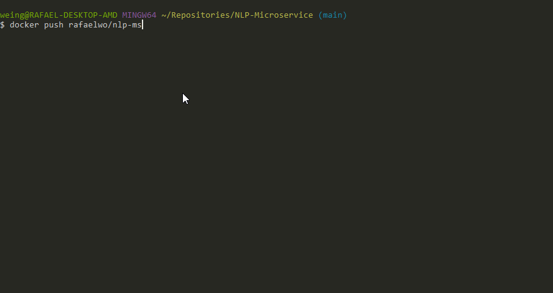

# NLP-Microservice

## 1. Environment
- Create conda environment: `conda create -n nlp-ms python=3.8`
- Dependencies:
  - API Stuff:
    - [Flask](https://flask.palletsprojects.com/en/1.1.x/): `pip install Flask`
    - [Flask-RESTX](https://flask-restx.readthedocs.io/en/latest/): `pip install flask-restx`
  - [🤗Transformers](https://github.com/huggingface/transformers) is used as NLP library: `pip install transformers`
  - [TensorFlow 2.0]() or [PyTorch]()
    - I used Pytorch (see [here](https://pytorch.org/get-started/locally/) for installation instructions) 
  
## 2. Simple Flask-RESTX App
```Python
# FILE: service.py

from flask import Flask
from flask_restx import Resource, Api

app = Flask(__name__)
api = Api(app)


@api.route('/hello')
class HelloWorld(Resource):
    def get(self):
        return {'hello': 'world'}


if __name__ == '__main__':
    app.run()
```


## 3. Add NLP Pipeline
```Python
# FILE: service.py

from flask import Flask, request
from flask_restx import Resource, Api, fields
from transformers import pipeline
import torch

app = Flask(__name__)
api = Api(app, version="0.1", title="AI Text-Generation")
ns = api.namespace("text-generation")

# Swagger defs
conversation_input_def = api.model("Text Generation Input", {
    'text': fields.String(required=True,
                          description="Input prompt",
                          help="Text cannot be blank.",
                          example="Artificial Intelligence is a")
})


device = 0 if torch.cuda.is_available() else -1
generate_pipe = pipeline("text-generation", device=device)     # Use default model of pipeline


@ns.route('/generate')
class Conversation(Resource):
    @ns.expect(conversation_input_def)
    def post(self):
        input_text = request.json['text']
        out = generate_pipe(input_text)
        generated_text = out[0]['generated_text']

        return {'generated': generated_text}


if __name__ == '__main__':
    app.run()
```


## 4. Pre-download Model in separate Script
This is very useful for running the API in a Docker container (see [step 5](#5.-run-the-api-in-docker)).
```Python
# FILE: download.py

from transformers import AutoTokenizer, AutoModelForCausalLM

model_str = "gpt2"
AutoTokenizer.from_pretrained(model_str).save_pretrained(f"local_model/{model_str}/tokenizer")
AutoModelForCausalLM.from_pretrained(model_str).save_pretrained(f"local_model/{model_str}/model")
```

Now the saved model can be used:
```Python
# FILE: service.py

from flask import Flask, request
from flask_restx import Resource, Api, fields
from transformers import pipeline, AutoTokenizer, AutoModelForCausalLM, AutoConfig
import torch

app = Flask(__name__)
api = Api(app, version="0.1", title="AI Text-Generation")
ns = api.namespace("text-generation")

# Swagger defs
conversation_input_def = api.model("Text Generation Input", {
    'text': fields.String(required=True,
                          description="Input prompt",
                          help="Text cannot be blank.",
                          example="Artificial Intelligence is a")
})


model_str = "gpt2"
tokenizer = AutoTokenizer.from_pretrained(f"local_model/{model_str}/tokenizer",
                                          config=AutoConfig.from_pretrained(f"local_model/{model_str}/model"))
model = AutoModelForCausalLM.from_pretrained(f"local_model/{model_str}/model")
device = 0 if torch.cuda.is_available() else -1
generate_pipe = pipeline("text-generation", model=model, tokenizer=tokenizer, device=device)


@ns.route('/generate')
class Conversation(Resource):
    @ns.expect(conversation_input_def)
    def post(self):
        input_text = request.json['text']
        out = generate_pipe(input_text, return_tensors=True, return_text=False)
        
        # Remove out input from the generated text
        out_ids = out[0]['generated_token_ids']
        input_ids = tokenizer.encode(input_text, add_special_tokens=False)
        generated_text = tokenizer.decode(out_ids[len(input_ids):])

        return {'input': input_text, 'generated': generated_text}


if __name__ == '__main__':
    app.run()
```

## 5. Run the API in docker
To "dockerize" this application we need a `Dockerfile`.
```dockerfile
FROM pytorch/pytorch
WORKDIR /usr/src/app

COPY . .

RUN pip install -r ./requirements.txt
RUN python ./src/download.py

ENTRYPOINT [ "python" ]
CMD [ "src/service.py" ]
```

We use the latest PyTorch image and install the remaining dependencies. 
Then we run the `download.py` script and set the entrypoint to run the main file in python.

Additionally, we have to set out `host` in our flask app to `0.0.0.0` so that it is exposed to localhost:

```python
# FILE: service.py

(...)

if __name__ == '__main__':
    app.run(host="0.0.0.0", port=5000)
```

It is also helpful to introduce a `.dockerignore` file so that only the necessary things
from this repo are copied to the docker container:
```
# Patterns, Folders
*.pyc
*.pyo
*.pyd
**/__pycache__
local_model
tutorial

# Files
Dockerfile
README.md
```

Then we can build and run our container:
```
docker build -t <your_username>/my-repo .
docker run -p 5000:5000 <your_username>/my-repo
```


And finally [push it to Docker-Hub][docker-hub]:
```
docker push <your_username>/my-private-repo
```




## 6. Run the pushed Docker image from any other Host
Since our docker image is now published to Docker-Hub, we can pull it from 
any other machine and run it there. To do this you simply have to log in
using `docker login` and provide your credentials. Then you can pull the 
image using `docker pull <your_username>/my-repo`.


[docker-hub]: https://docs.docker.com/docker-hub/#step-4-build-and-push-a-container-image-to-docker-hub-from-your-computer